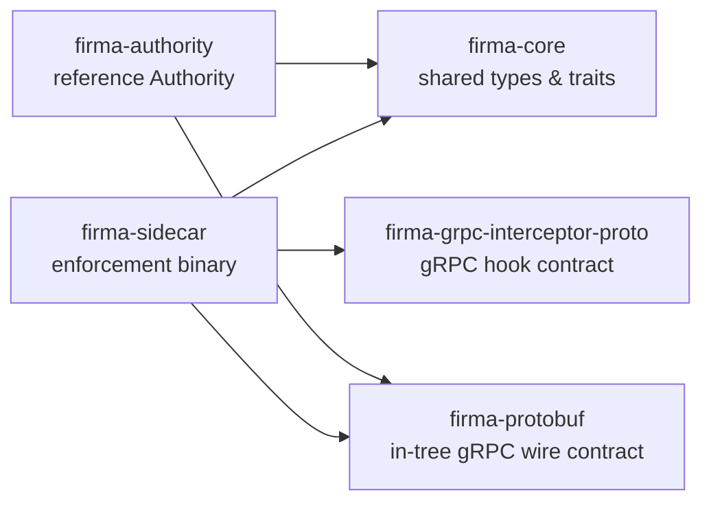
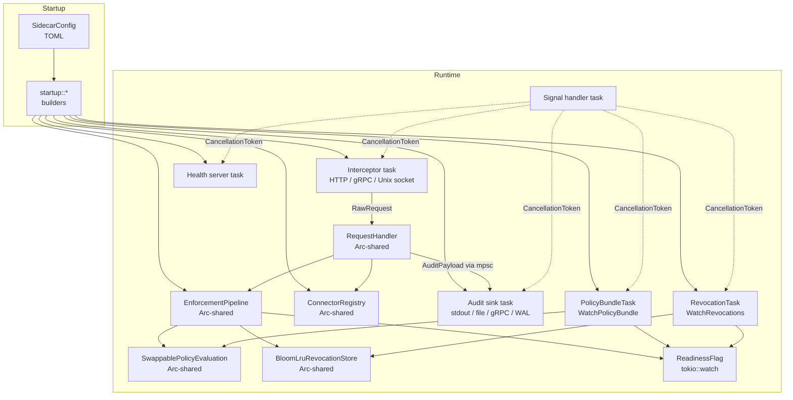
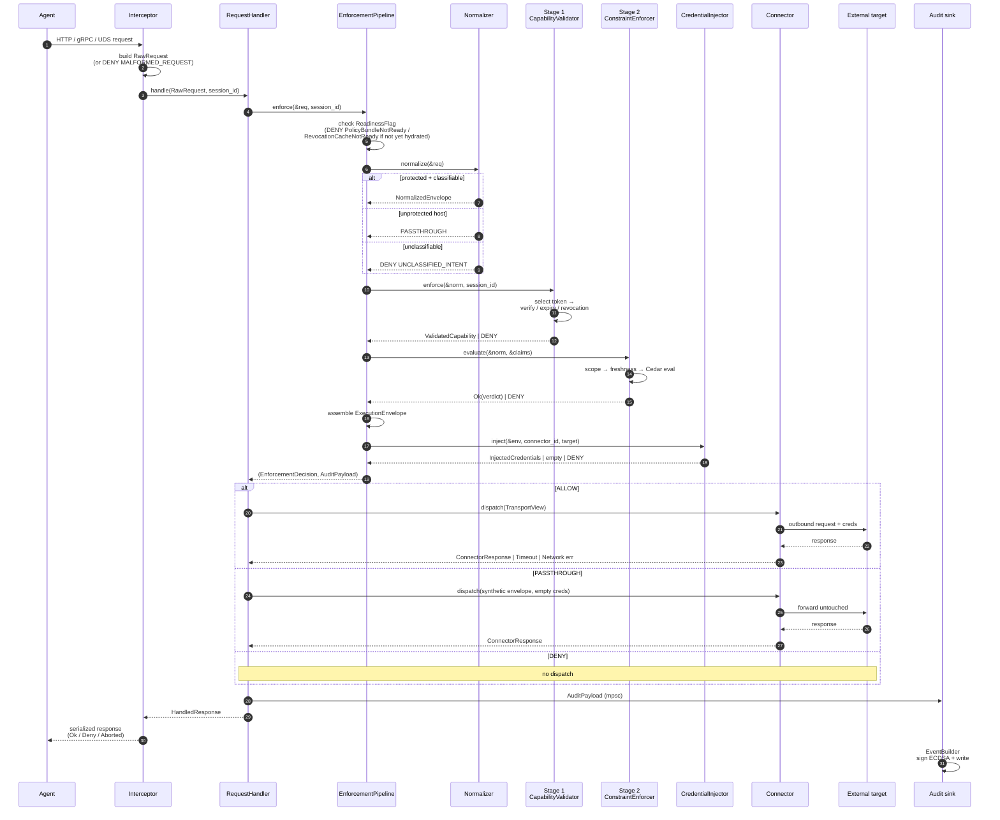
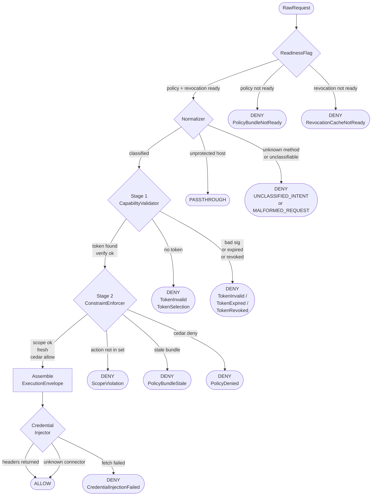
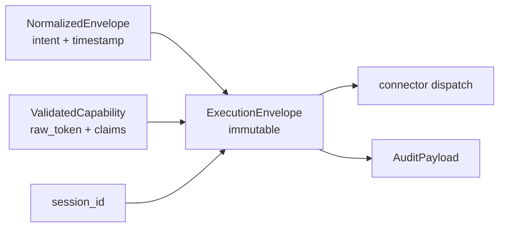
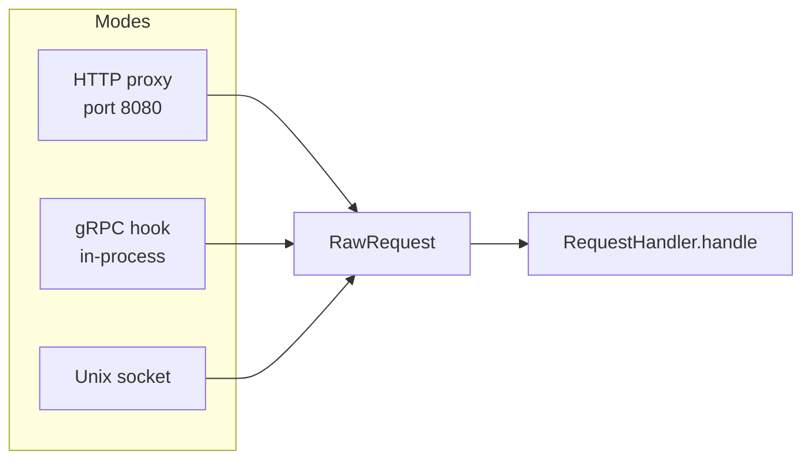
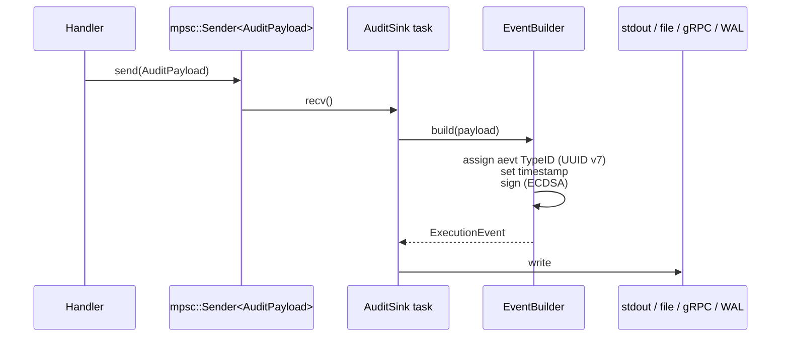

# Sidecar Architecture Overview

A tour of `firma-sidecar`: what the components are, how they fit together,
and what happens to a single outbound agent call as it traverses the
binary.

This document is the entry point for new contributors. Stage-level
contracts live in [sidecar-interfaces.md](./sidecar-interfaces.md); bypass
analysis lives in [bypass-risks.md](./bypass-risks.md).

## 1. Mental model

The sidecar is an L7 policy enforcement proxy. Every outbound agent call
(HTTP, gRPC, Unix socket) enters the sidecar, gets classified against a
canonical action registry, validated against a capability token,
evaluated against a Cedar policy bundle, and — only if all stages pass —
dispatched to the external system with injected credentials. Every
outcome emits a signed audit event.

Four invariants shape the design:

- **Fail-closed** — every error path returns DENY.
- **No network on the hot path** — Stage 1 and Stage 2 are fully local.
- **Deterministic** — same input + same bundle ⇒ same decision.
- **Envelope immutability** — `ExecutionEnvelope` is built once and never
  mutated in place.

## 2. Crate layout



| Crate                          | Role                                                                                                                                                                    |
| ------------------------------ | ----------------------------------------------------------------------------------------------------------------------------------------------------------------------- |
| `firma-core`                   | Domain types (`ExecutionEnvelope`, `CapabilityClaims`, `Decision`) and traits.                                                                                          |
| `firma-protobuf`               | Vendored in-tree (`crates/firma-protobuf`): generated `firma.v1` gRPC contract used by audit sink and Authority streams. Owns the `EnforcementDecision` enum (AARM R4). |
| `firma-grpc-interceptor-proto` | Contract for the in-process gRPC hook interceptor.                                                                                                                      |
| `firma-sidecar`                | The enforcement binary — interceptors, pipeline, connector, audit, startup.                                                                                             |
| `firma-authority`              | Reference Authority for local dev. Issues PASETO tokens, streams policy bundles.                                                                                        |

## 3. Top-level runtime

At startup, `main.rs` loads configuration, spawns long-lived tasks, and
wires them together through in-process channels. When
`sidecar.authority.url` is configured, two additional background tasks
keep policy and revocation state current.



Key wiring facts:

- The `RequestHandler` is the only piece that sees both enforcement and
  dispatch. It owns the channel senders for audit payloads.
- The audit sink runs in its own task and consumes `AuditPayload` values
  over a bounded `mpsc` channel (capacity 100). Signing happens on the
  sink side, not on the hot path.
- `PolicyBundleTask` and `RevocationTask` share a single tonic
  `Channel` to the Authority but run independent stream loops with
  per-stream exponential backoff, so a failure on one stream does not
  stall the other.
- `SwappablePolicyEvaluation` is a lock-free `ArcSwap` wrapper over the
  current `PolicyEvaluation`. Stage 2 reads it through the trait; the
  policy-bundle task parses each accepted bundle into a
  `CedarPolicyEvaluator` via `CedarBundleParser`, swaps it into the
  container, and refreshes the TTL deadline used by `is_fresh()`.
- `BloomLruRevocationStore` is shared as `Arc<dyn RevocationStore>`
  between Stage 1 (reader) and the revocation task (writer).
- `ReadinessFlag` fans out to the pipeline as a `tokio::watch::Receiver`
  so the hot-path readiness check is a single atomic borrow.
- Shutdown is a single `CancellationToken` fan-out. SIGTERM/SIGINT
  cancels; every task drains and returns.

## 4. Request lifecycle

The path of one outbound call, end to end:



## 5. Enforcement pipeline internals

The pipeline is the single entry point to enforcement. It chains four
stages and short-circuits on the first failure.



### 5.1 Normalizer

Deterministic rule-based mapping from `(method, host, path)` to a
canonical `action_class` drawn from the v0.1 Action Class Registry
(52 classes). Strips sensitive headers (`authorization`, `cookie`,
`set-cookie`, `proxy-authorization`, `x-api-key`) before they enter
the envelope. No LLM, no heuristic classifier on the hot path.

`MappingTable::from_config` fails closed at load time on a duplicate
`(method, host, path)` tuple, an action class outside the registry, or —
since `docs/architecture/mapping-rules-prover-plan.md` — a rule sharing an
exact `(host, path)` tuple with other rules whose combined method coverage
already claims every method it could itself match, making it permanently
unreachable. `firma mapping-rules validate` checks a configuration against
this and a second, advisory registry-reachability property offline, before
deployment — see
<https://firma-ai.github.io/openfirma/guides/validate-mapping-rules/>.

### 5.2 Stage 1 — Capability Validation

1. Select a token from the `CapabilityMap` keyed by
   `(session_id, action_class, resource)`.
2. Parse and verify the PASETO v4 signature.
3. Check expiry against the current clock (plus configured skew).
4. Check revocation against the local `RevocationStore`, a two-layer
   cache implemented by `BloomLruRevocationStore`
   (`enforcement::revocation`):
   1. **Bloom filter (lock-free).** Compute k hash indices from
      `xxh3_128(token_id)` and load the corresponding bits. Any bit
      clear means definitely not revoked, returning `Ok(false)`. This
      is the common path and stays sub-microsecond.
   2. **LRU cache (mutex-guarded).** All bits set triggers a lookup in
      the LRU: a hit confirms revocation (`Ok(true)`); a miss is either
      a bloom false positive or an evicted true revocation, and also
      returns `Ok(true)` to honor the spec's "REVOKED is terminal"
      invariant.

Every substep on failure maps to a DENY with a distinct `DenyReason`.
Target: < 1 ms p95.

Sizing is configurable via `[sidecar.revocation]` in `firma.toml`.
Defaults: `capacity = 1_000_000`, `fpr = 0.0001`, and
`lru_capacity = 100_000` — about 14 MB total (bloom 2.4 MB + LRU
12 MB), well inside the < 100 MB RSS budget. Counters exposed:
`bloom_hits`, `lru_hits`, `bloom_positive_lru_miss`, and
`revocations_total`.

### 5.3 Cedar context attributes

Stage 2 builds the Cedar `EnforcementContext` from the immutable request
envelope, validated capability claims, and per-session runtime signals.
The canonical schema lives in
`crates/firma-core/firma.cedarschema` (embedded in the binary); the sidecar test
schema in `cedar_evaluator.rs` must match it exactly.

| Attribute            | Cedar type | Source                                                                  |
| -------------------- | ---------- | ----------------------------------------------------------------------- |
| `session_id`         | `String`   | `CapabilityClaims.session_id` from Stage 1 validation                   |
| `timestamp_ms`       | `Long`     | `NormalizedEnvelope.timestamp` converted to epoch milliseconds          |
| `params`             | `String`   | JSON-serialized `ActionParams` from the normalized request              |
| `risk_score`         | `Long`     | `RuntimeSignals.risk_score_long()` from `SessionStateStore`             |
| `session_duration_s` | `Long`     | `(envelope.timestamp - claims.issued_at).num_seconds()` clamped at zero |
| `action_count`       | `Long`     | `RuntimeSignals.action_count`, including the current admitted call      |

### 5.4 Per-session state

`SessionStateStore` holds runtime signals keyed by `SessionId`. The V1
runtime uses `LruSessionStateStore`, an in-memory LRU cache with a fixed
capacity of 8192 sessions per sidecar process.

The pipeline updates this state between Stage 1 and Stage 2:

- Stage 1 ALLOW calls `record_action(session_id)` before Cedar
  evaluation, so the first policy-visible request sees
  `action_count = 1`.
- Stage 1 DENY returns before the store is touched, so malformed,
  expired, or revoked tokens do not burn per-session quota.
- The pipeline then reads `signals(session_id)` and reuses the same
  `RuntimeSignals` for both Cedar context construction and
  `ExecutionMetadata`, keeping policy inputs and audit metadata aligned.
- In V1, `risk_score` is a placeholder sourced from the store but remains
  `0.0` unless a future task wires a real producer.

#### 5.2.1 Revocation check flow

**Reader (`is_revoked`) — hot path.**

```mermaid
flowchart TB
    start([is_revoked&#40;token_id&#41;])
    start --> hash[xxh3_128&#40;token_id&#41; → k indices]
    hash --> bloom{All k bloom<br/>bits set?}
    bloom -->|no: any bit clear| negret([Ok&#40;false&#41;<br/>definitely not revoked<br/>lock-free fast path])
    bloom -->|yes: all bits set| bhit[bloom_hits++]
    bhit --> lru{LRU contains<br/>token_id?}
    lru -->|hit| lhit[lru_hits++] --> deny1([Ok&#40;true&#41;<br/>confirmed revoked])
    lru -->|miss| lmiss[bloom_positive_lru_miss++] --> deny2([Ok&#40;true&#41;<br/>fail-closed:<br/>bloom false positive<br/>or evicted revocation<br/>&#40;rare&#41;])
```



**Writer (`add_revocation`) — off the hot path.**

```mermaid
flowchart LR
    src([WatchRevocations<br/>Authority stream]) --> add[add_revocation&#40;token_id&#41;]
    add --> b1[bloom: fetch_or k bits<br/>lock-free, idempotent]
    add --> l1[LRU: put&#40;token_id&#41;<br/>mutex, may evict oldest]
    b1 --> m1[revocations_total++<br/>tracing::info event]
    l1 --> m1
```



The writer side is driven by the `RevocationTask` described in §5.6.
Stage 1 holds the same `Arc<dyn RevocationStore>` as the writer, so
every push is visible on the next `is_revoked` call. The tracing event
emitted on every insert anchors the revocation propagation metric:
Authority push to first Stage 1 DENY < 1 s p99.

### 5.3 Stage 2 — Constraint Enforcement

1. **Scope check** — is the request's `action_class` in the token's
   `action_set`? `"*"` wildcards pass.
2. **Bundle freshness** — is `PolicyEvaluation::is_fresh()` true?
3. **Cedar evaluation** — build the context and call the policy engine.

Stage 2 holds the evaluator as `Arc<dyn PolicyEvaluation>`. In the
Authority-backed runtime the concrete pointer targets a
`SwappablePolicyEvaluation`: an `ArcSwap` over the compiled evaluator
plus an atomic TTL deadline. The inner snapshot is a
`CedarPolicyEvaluator` built from the bundle bytes the Authority pushed
over `WatchPolicyBundle`. `evaluate()` reads through the current
snapshot; `is_fresh()` reads the atomic deadline. The
`PolicyBundleTask` (§5.6) updates both atomically when a new bundle
arrives, so in-flight calls finish against the previous snapshot. When
the deadline elapses without a refresh, `is_fresh()` flips to `false`
and this stage denies with `PolicyBundleStale` — the fail-closed
behavior required by the spec.

Target: < 200 µs p95. Like Stage 1, this runs entirely in-process;
the Authority is never on the hot path.

### 5.4 Credential injection

Runs only after Stage 2 returns Ok. Given the connector ID (the
envelope's resource host) and the target, resolves credential headers
to be merged into the outbound request. `UnknownConnector` is treated
as passthrough (empty headers); any other fetch error fails closed.

### 5.5 Envelope assembly and audit payload



`ExecutionEnvelope::new()` produces a value with private fields and
shared-reference getters; once built it is never mutated.

### 5.6 Authority stream clients

When `sidecar.authority.url` is set, `startup` spawns two long-lived
tasks from `authority_client`:

- **`PolicyBundleTask`** calls `WatchPolicyBundle` and, on each
  `PolicyBundleUpdate`, parses the bytes into a fresh
  `PolicyEvaluation` via the pluggable `BundleParser` trait and calls
  `SwappablePolicyEvaluation::swap`, which updates the evaluator
  snapshot, TTL deadline, and version in a single store. A failed
  parse is logged and the previous bundle is retained. The first
  accepted bundle flips `ReadinessFlag::policy_bundle_ready`. On each
  accepted bundle, `CedarBundleParser` parses the policy bytes and
  (when present) the Cedar schema bytes into a `CedarPolicyEvaluator`;
  parse failures retain the previous snapshot.

- **`RevocationTask`** calls `WatchRevocations` and forwards each
  `RevocationEvent` to `RevocationStore::add_revocation` on the shared
  bloom+LRU store. The task records the latest event timestamp and
  resends it as `since` on reconnect so the Authority can replay any
  missed events. `ReadinessFlag::revocation_ready` flips on the first
  event OR after a configurable grace period
  (`revocation_readiness_grace`, default `"500ms"`) after the stream
  opens — whichever comes first. When
  `revocation_fail_closed_on_disconnect` is true, the readiness bit
  flips back to `false` on disconnect; by default it stays set and
  the cache continues serving from its last-known state.

Both tasks share a single lazy `tonic::transport::Channel` but run
independent reconnect loops with exponential backoff
(`reconnect_min_backoff` / `reconnect_max_backoff`) and
symmetric jitter. Shutdown is driven by the same `CancellationToken`
that shuts the rest of the runtime down.

`ReadinessFlag` is a `tokio::sync::watch` producer with a matching
`ReadinessView` consumer. The pipeline's readiness check is a single
atomic borrow on the watch channel — no lock, no allocation. When
`sidecar.authority.url` is unset (dev mode), the pipeline is constructed with
a view that is pre-populated to all-ready so local runs do not wedge
behind a stream that will never connect.

## 6. Dispatch and the abort path

The `RequestHandler` runs after enforcement. It owns the connector
registry and translates connector outcomes into the agent-visible
response plus an enriched audit payload.

```mermaid
stateDiagram-v2
    [*] --> Enforce
    Enforce --> Allow: ALLOW
    Enforce --> Passthrough: PASSTHROUGH
    Enforce --> DenyPre: DENY
    Allow --> Dispatch
    Passthrough --> Dispatch
    Dispatch --> Ok: 2xx / 4xx / 5xx from target
    Dispatch --> Aborted: ConnectorError::Timeout
    Dispatch --> DenyPost: ConnectorError::Network / InvalidRequest
    Ok --> [*]: HandledResponse::Ok
    Aborted --> [*]: HandledResponse::Aborted<br/>(CONNECTOR_TIMEOUT)
    DenyPre --> [*]: HandledResponse::Deny
    DenyPost --> [*]: HandledResponse::Deny
    Passthrough --> [*]
```

The AARM R4 five-decision set is emitted as proto-wire decision codes in
audit events (`PASSTHROUGH` is serialized as `ALLOW` with an empty
`token_id`):

| Code | Meaning | Source                                                                                                                                                          |
| ---- | ------- | --------------------------------------------------------------------------------------------------------------------------------------------------------------- |
| `1`  | ALLOW   | Pipeline allowed and connector returned a response (any status). Also PASSTHROUGH.                                                                              |
| `2`  | DENY    | Pipeline denied, or connector reported `Network` / `InvalidRequest`.                                                                                            |
| `3`  | ABORT   | Approved call aborted mid-flight (`ConnectorError::Timeout`).                                                                                                   |
| `4`  | MODIFY  | AARM R4: a structural transformation (e.g. header redaction) was applied to the dispatch clone before forwarding; the audit records the applied transformation. |
| `5`  | STEP_UP | AARM R4: blocked pending human approval (`DenyReason::StepUpRequired`).                                                                                         |
| `6`  | DEFER   | AARM R4: blocked and deferred for retry (`DenyReason::Deferred`).                                                                                               |

ABORT is distinct from DENY because the pipeline did approve the call;
the token stays ACTIVE and the agent sees a gateway-timeout-class error.
MODIFY applies a structural transformation to the dispatch clone (V1
supports `redact_header:<name>`) before forwarding; the original envelope
is preserved for audit, and the applied transformation is recorded in the
audit `deny_reason` field. STEP_UP and DEFER block the call (the
agent receives a structured 403 whose `DenyReason` tells it how to
recover) and are sourced from `@step_up` / `@defer` annotations on
`forbid` Cedar policies.

### 6.1 Error mapping

The generic HTTP connector classifies every `reqwest::Error` before it
crosses the connector boundary. Mapping order is timeout, then builder,
then the transport family. Unknown or all-false flag combinations
fail closed to `Network` and emit a WARN log for operator visibility.

| reqwest signal                                | `ConnectorError`            | Runtime decision                   |
| --------------------------------------------- | --------------------------- | ---------------------------------- |
| `is_timeout()`                                | `Timeout(configured)`       | ABORT (`CONNECTOR_TIMEOUT`)        |
| outer `tokio::time::timeout` elapsed          | `Timeout(configured)`       | ABORT (`CONNECTOR_TIMEOUT`)        |
| `is_builder()` on `RequestBuilder::build()`   | `InvalidRequest(detail)`    | DENY (`CONNECTOR_INVALID_REQUEST`) |
| `is_connect()`                                | `Network("connect: ...")`   | DENY (`CONNECTOR_NETWORK_ERROR`)   |
| `is_request()` with no stronger matching flag | `Network("request: ...")`   | DENY (`CONNECTOR_NETWORK_ERROR`)   |
| `is_body()`                                   | `Network("body: ...")`      | DENY (`CONNECTOR_NETWORK_ERROR`)   |
| `is_decode()`                                 | `Network("decode: ...")`    | DENY (`CONNECTOR_NETWORK_ERROR`)   |
| no flag set (forward-compat fallback)         | `Network("transport: ...")` | DENY (`CONNECTOR_NETWORK_ERROR`)   |

### 6.2 Dispatch log contract

`dispatch()` emits structured `tracing` events around every outbound
call. The outer `tokio::time::timeout` covers rate-limit wait,
request execution, and response body drain, so the success and failure
latency fields reflect the whole dispatch budget.

| Event level | Message           | Fields                                                  |
| ----------- | ----------------- | ------------------------------------------------------- |
| DEBUG       | `dispatching`     | `target_host`, `method`, `path`                         |
| DEBUG       | `dispatched`      | `target_host`, `method`, `path`, `status`, `latency_us` |
| ERROR       | `dispatch failed` | `target_host`, `method`, `path`, `kind`, `elapsed_us`   |

Never logged: header values, `Authorization` credentials, credential
maps, or body bytes. Header names may appear in surrounding request
construction code paths, but header values do not.

## 7. Interceptors

Three modes produce the same `RawRequest` shape, keeping the downstream
stages transport-agnostic.



Contract highlights:

- Any parse failure returns a structured DENY with
  `MALFORMED_REQUEST` (fail-closed).
- On cancellation, the interceptor stops accepting new connections and
  drains in-flight work before returning `Ok(())`.
- eBPF kernel-level capture is on the roadmap; not in V1.

### 7.1 HTTPS CONNECT and MITM behavior

The sidecar now provides explicit HTTPS `CONNECT` support in the HTTP interceptor to
unblock real-world HTTPS agent traffic (OpenAI, Supabase, Resend, etc.)
through `firma run`.

Implementation model:

- CONNECT-only mode:
  - The sidecar evaluates policy at CONNECT handshake time on `host:port`.
  - On allow, the sidecar returns `200` and relays raw TCP bytes
    bidirectionally.
  - On deny, the sidecar returns structured `403` deny JSON.
  - CONNECT allow/deny outcomes emit audit events.
- MITM mode (default for configured `intercept_hosts`):
  - The sidecar terminates downstream TLS with a dynamically issued per-host
    certificate signed by the local sidecar CA.
  - Decrypted HTTPS requests are routed through the normalizer + handler
    pipeline, so policy/audit are L7-consistent with plain HTTP.
  - Upstream calls are re-encrypted through the existing connector/provider path.
  - Interception scope is controlled by `intercept_hosts` / `bypass_hosts`
    and can be hardened with `strict_hosts`.

Pingora-specific note:

- We observed that Pingora default behavior rejects CONNECT with `405`
  unless `allow_connect_method_proxying` is enabled.
- Even after enabling that flag, our forward-proxy path still produced
  `502` for real HTTPS CONNECT targets in E2E.
- The sidecar resolves this by handling CONNECT tunnel lifecycle explicitly in
  the sidecar HTTP interceptor runtime, with optional TLS MITM interception
  for configured hosts.

### 7.2 Denial contexts and response shapes

FEP §5 distinguishes two structurally different denial contexts. The
sidecar derives the context at the handler layer from the
`NormalizedEnvelope` carried on `EnforcementDecision::Deny`.
Interceptors select the transport response from
`HandledResponse::Deny.context` without re-inspecting the envelope.

- **`DenialContext::Api`** — synchronous terminal failure. HTTP
  interceptors return **403 Forbidden** with the canonical
  `deny_body_json` payload:
  `{ "denied": true, "reason", "detail" }`. 403 is used (not 401)
  because the token is valid but the action falls outside the
  permission boundary.
- **`DenialContext::Tool`** — tool-call denial. The body is a
  machine-readable tool result produced by `tool_denial_body_json`:
  `{ "denied": true, "reason", "action_class", "tool_name", "detail" }`.
  The agent receives this as it would any other tool result and the
  session continues.

Context derivation (`denial_context_of`):

| Envelope state                              | Context             |
| ------------------------------------------- | ------------------- |
| `intent.params == ActionParams::ToolUse`    | `Tool`              |
| `intent.params == ActionParams::Http`       | `Api`               |
| `intent.params == ActionParams::DbQuery`    | `Api`               |
| `envelope == None` (pre-normalization deny) | `Api` (fail-closed) |

Fail-closed rationale: when the sidecar cannot prove the call is a
tool call, it defaults to the hard-block shape. A tool denial on a
non-tool call would silently mask the failure.

**V1 scope.** No interceptor currently originates from a tool-call
transport (MCP stdio, tool-use gateway, etc.). The HTTP proxy,
Tonic gRPC, and UDS interceptors all serve HTTP-class traffic and
treat both `Tool` and `Api` identically: HTTP 403 + `deny_body_json`
(or the gRPC `allowed=false` equivalent). `tool_denial_body_json` is
unit-tested and ready to be called from a future tool-call transport
with no further changes to the pipeline or handler.

## 8. Audit subsystem



`AuditPayload` is the lightweight hot-path struct (no signing, no event ID).
`ExecutionEvent`, defined by `firma-audit-schema`, is the full signed record
written by every sink. The shared representational crate keeps Sidecar output,
tests, and third-party deserializers on one schema without pulling in runtime
behavior. Moving ECDSA off the hot path is what keeps the enforcement p95
budget achievable (see `5be5c69`).

## 9. Module map

```text
crates/firma-audit-schema/src/lib.rs — Decision and serializable ExecutionEvent.

crates/firma-sidecar/src/
├── main.rs                 — startup, signal handling, task join.
├── args.rs                 — CLI flags.
├── config{.rs,/}           — TOML schema + per-section validation.
├── startup{.rs,/}          — builders: pipeline, connector, credential, audit, interceptor.
├── interceptor{.rs,/}      — Interceptor trait + HTTP / gRPC / Unix socket modes.
├── handler.rs              — RequestHandler (enforce → dispatch → audit emit).
├── normalizer{.rs,/}       — IntentNormalizer + MappingTable + RawRequest.
├── enforcement{.rs,/}
│   ├── capability_map.rs   — indexed token selection.
│   ├── capability_validation.rs — Stage 1.
│   ├── constraint_enforcement.rs — Stage 2 + PolicyEvaluation trait.
│   ├── decision.rs         — EnforcementDecision + stage enums.
│   ├── error.rs            — fail-closed error → DENY mapping.
│   ├── registry.rs         — 15-class Action Class Registry v0.1.
│   └── revocation{.rs,/}   — bloom filter + LRU revocation cache.
├── pipeline.rs             — EnforcementPipeline::enforce() + audit payload projection.
├── credential{.rs,/}       — CredentialInjector trait + Null / Basic / Vault providers.
├── connector{.rs,/}        — ConnectorRegistry + generic HTTP provider.
├── audit{.rs,/}            — AuditPayload, EventBuilder, transport mapping, sinks.
├── authority_client{.rs,/} — WatchPolicyBundle + WatchRevocations stream tasks,
│                             SwappablePolicyEvaluation, ReadinessFlag, backoff.
├── health.rs               — liveness probe server.
└── log.rs                  — tracing init.
```

## 10. Standalone startup sequence

`firma sidecar --config <path>` (and `examples/demo/run.sh`) emit
exactly seven INFO lines on every successful start, in order:

```text
config loaded             path="…"
mapping table loaded      rules=N
policy bundle loaded      version="…" policies=N
authority stream connected endpoint="…"
connector registry built  hosts=N default_timeout_ms=T
interceptor listening     addr="…"
ready
```

The contract is locked by
`crates/firma-sidecar/tests/startup_contract.rs` and consumed by
`examples/demo/`. Operators automating the binary should wait for `ready`
before sending traffic.

## 11. Where to go next

- Stage contracts and input/output shapes →
  [sidecar-interfaces.md](./sidecar-interfaces.md).
- How each stage is protected from being skipped →
  [bypass-risks.md](./bypass-risks.md).
- CLI flags and exit codes → `docs/cli.md`.
- Configuration reference (TOML sections, defaults) →
  `docs/configuration.md`.
- End-to-end demo runbook → `examples/demo/README.md`.
